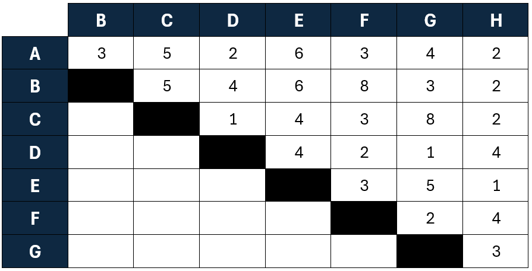

Mini proyecto centrado en el uso de grafos para el trazado de recorridos óptimos. En este caso, se quiere construir un ferrocarril metropolitano que conecte 8 barrios de la capital.

# Recorrido de un ferrocarril con grafos en R

## Descripción del proyecto

Se quiere construir un ferrocarril metropolitano que conecte 8 barrios de la capital que denotaremos por A, B, C, D, E, F, G, H. La duración estimada del viaje directo entre cada dos de los barrios viene dada por la tabla adjunta.

```{r, echo = FALSE, fig.cap = "", out.width = "60%", fig.align = "center"}

```

Importamos la lista de nodos/pesos y lo convertimos en la matriz de adyacencia.

```{r}
#| message: false
#| warning: false

# Leer libros de Excel
library (readxl)
# Manejo de datos
library(tidyverse)
# Mostrar tablas en HTML (datatable)
library(DT)
# Grafos
library(igraph)

# edgelist
edges <- as.data.frame(read_xlsx(path = "./recursos/matriz.xlsx", sheet = "edgelist"))

# cambiamos el index para construir correctamente la matriz
m <- edges[,-1]
rownames(m) <- edges[,1]

# casteamos a matriz
m <- as.matrix(m)

# vista previa rápida
m
```

Visualizamos el grafo.

```{r}
#| message: false
#| warning: false
# matriz de adyacencia con pesos
ig <- graph_from_adjacency_matrix(m, mode="undirected", weighted=TRUE)

# set seed for reproducibility
set.seed(1)

# create random layout
#layout <- layout_randomly(grafo)

# Colores
V(ig)$color <- rainbow(8, alpha=1)

list <- as.data.frame(as_edgelist(ig))
list <- list[2] |> mutate_each(funs(chartr("ABCDEFGH","12345678",.)))

E(ig)$color <-  apply(X = list, MARGIN = 1, 
                 #FUN = function(x) x) #V(ig)$color[x])[2]
                 FUN = function(x) V(ig)$color[as.numeric(x)])


# plot
plot(ig,
     #layout = layout,
     rescale=TRUE,
     edge.width=2,
     edge.color=E(ig)$color,
     edge.label=E(ig)$weight,
     vertex.size=20,
     vertex.color=V(ig)$color,
     edge.arrow.width=0.7,
     edge.lty= 1,
     margin=0)
```

## 1. Construcción y visualización del grafo

```{r, echo = FALSE, fig.cap = "", out.width = "100%", fig.align = "center"}
knitr::include_graphics("./recursos/ej1-1.png")
```

## 2. ¿Qué estaciones han de conectarse de forma que la duración del viaje entre el barrio A y cualquier otro barrio sea lo más corto posible?

### Paso inicial

Comenzamos indicando la distancia desde el nodo A hasta todos los nodos del siguiente modo y marcando en rojo las etiquetas permanentes:

<font style="color:red;">uA=0</font>      uB=3      uC=5      <font style="color:red;">uD=2</font>      uE=6      uF=3      uG=4      <font style="color:red;">uH=2</font>

También es importante ir almacenando el predecesor de cada nodo:

**p(B)=A; p(C)=A; p(D)=A; p(E)=A; p(F)=A; p(G)=A; p(H)=A**

### Paso 1

(k=D) y (k=H), los nodos permanentes del paso previo.

Actualizamos distancias y predecesores del resto:

- (u(B)=\min(u(B),u(D)+d(D,B),u(H)+d(H,B))=\min(3,2+4,2+2)=3), (p(B)=A)
- (u(C)=\min(u(C),u(D)+d(D,C),u(H)+d(H,C))=\min(5,2+1,2+2)=3), (p(C)=D)
- (u(E)=\min(u(E),u(D)+d(D,E),u(H)+d(H,E))=\min(6,2+4,2+1)=3), (p(E)=H)
- (u(F)=\min(u(F),u(D)+d(D,F),u(H)+d(H,F))=\min(3,2+2,2+4)=3), (p(F)=A)
- (u(G)=\min(u(G),u(D)+d(D,G),u(H)+d(H,G))=\min(4,2+1,2+3)=3), (p(G)=D)

### Solución

**A-D, A-H, A-B, A-F, D-C, D-G, H-E**

```{r, echo = FALSE, fig.cap = "", out.width = "100%", fig.align = "center"}
knitr::include_graphics("./recursos/ej1-2.png")
```

```{r}
#| message: false
#| warning: false
#| echo: false

# edgelist
edges <- data.frame(from=c("A", "A", "A", "A", "D", "D", "H"),
                      to=c("D", "H", "B", "F", "C", "G", "E"),
                      weight=c(2,2,3,3,3,3,3))

# grafo
ig <- graph_from_data_frame(edges, directed = FALSE)

# set seed for reproducibility
set.seed(5)


# Colores
V(ig)$color <- rainbow(8, alpha=1)

list <- as.data.frame(as_edgelist(ig))
list <- list[2] |> mutate_each(funs(chartr("ABCDEFGH","12345678",.)))

#E(ig)$color <-  apply(X = list, MARGIN = 1,
 #                FUN = function(x) V(ig)$color[as.numeric(x)])


# plot
plot(ig,
     #layout = layout,
     rescale=TRUE,
     edge.width=2,
     #edge.color=E(ig)$color,
     edge.label=E(ig)$weight,
     vertex.size=20,
     vertex.color=V(ig)$color,
     edge.arrow.width=0.7,
     edge.lty= 1,
     margin=0)
```

Se soluciona calculando el árbol de soporte de peso mínimo.

## 3. Supongamos que los representantes de cada barrio se han reunido con el fin de crear un proyecto que consista en conectar todos los barrios de manera que el coste total de dicho proyecto sea mínimo. Si el coste es directamente proporcional a la duración del viaje entre cada par de barrios.

### Inicio

Elegimos un nodo inicial, por ejemplo A, y lo marcamos como visitado.

Entre todas las aristas que salen de A, seleccionamos la de menor coste:

- A,D = 2
- A,H = 2

Como hay empate, la elección es arbitraria, así que se escoge primero A,D = 2.

### Paso 1

Ahora los nodos visitados son A y D. Se consideran todas las aristas que salgan de dichos nodos a otros no visitados:

- A,H = 2
- A,B = 3
- A,F = 3
- A,G = 4
- A,C = 5
- A,E = 6
- D,C = 1
- D,G = 1
- D,E = 4
- D,F = 2
- D,B = 4
- D,H = 4

De nuevo tenemos empate, y se elige la que primero aparece: D,C = 1.

### Paso 2

Nodos visitados: A, D, C. Se consideran aristas desde esos nodos a otros no visitados; si nos fijamos en D,G = 1 de antes, se selecciona porque es el menor.

### Paso 3

Nodos visitados: A, D, C, G. Se consideran aristas a no visitados y se elige A,H = 2, resolviendo el empate de forma arbitraria.

### Paso 4

Nodos visitados: A, D, C, G, H. Entre las opciones hacia B, E y F, se selecciona H,E = 1 como la menor.

### Paso 5

Nodos visitados: A, D, C, G, H, E. Falta conectar B y F. Entre las conexiones posibles, H,B = 2 resulta la menor.

### Paso 6

Nodos visitados: A, D, C, G, H, E, B. Falta F. La menor arista hacia F es D,F = 2.

### Paso 7

Al finalizar, el árbol de expansión mínima queda con los nodos:

[**D,C = 1      D,G = 1      H,E = 1      A,D = 2      A,H = 2      H,B = 2      D,F = 2**]{style="color:red;"}

La suma total se corresponde con el coste mínimo para conectar todos los barrios:

[**1 + 1 + 1 + 2 + 2 + 2 + 2 = 11**]{style="color:red;"}

```{r, echo = FALSE, fig.cap = "", out.width = "100%", fig.align = "center"}
knitr::include_graphics("./recursos/ej1-3.png")
```

### Solución

```{r, echo = FALSE, fig.cap = "", out.width = "100%", fig.align = "center"}
knitr::include_graphics("./recursos/ej1-4.png")
```

```{r, echo = FALSE, fig.cap = "", out.width = "100%", fig.align = "center"}
knitr::include_graphics("./recursos/ej1-5.png")
```

```{r}
#| message: false
#| warning: false
#| echo: false

# edgelist
edges <- data.frame(from=c("D", "D", "H", "A", "A", "H", "D"),
                      to=c("C", "G", "E", "D", "H", "B", "F"),
                      weight=c(1,1,1,2,2,2,2))

# grafo
ig <- graph_from_data_frame(edges, directed = FALSE)

# set seed for reproducibility
set.seed(5)


# Colores
V(ig)$color <- rainbow(8, alpha=1)

list <- as.data.frame(as_edgelist(ig))
list <- list[2] |> mutate_each(funs(chartr("ABCDEFGH","12345678",.)))

#E(ig)$color <-  apply(X = list, MARGIN = 1,
 #                FUN = function(x) V(ig)$color[as.numeric(x)])


# plot
plot(ig,
     #layout = layout,
     rescale=TRUE,
     edge.width=2,
     #edge.color=E(ig)$color,
     edge.label=E(ig)$weight,
     vertex.size=20,
     vertex.color=V(ig)$color,
     edge.arrow.width=0.7,
     edge.lty= 1,
     margin=0)
```
